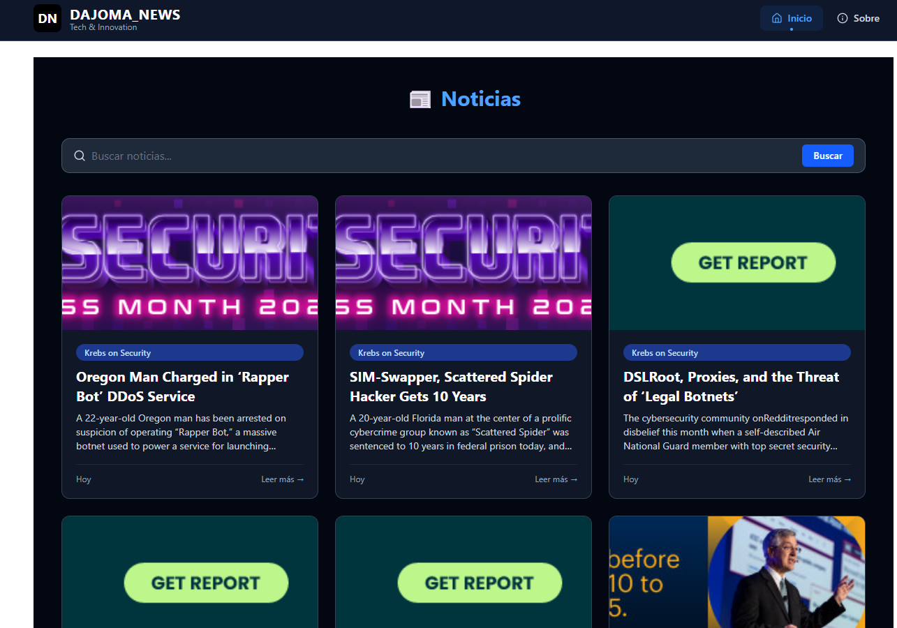

# Proyecto Next.js - Noticias con Imágenes

Este es un proyecto de [Next.js](https://nextjs.org) que muestra noticias con imágenes conectándose a una API de scraping.

## 🚀 Ver en vivo

**URL de la aplicación:** [https://tu-app-noticias.vercel.app](https://tu-app-noticias.vercel.app)

## 📸 Vista previa


*Sección principal mostrando noticias con imágenes*

## Características

- Sección de noticias con imágenes
- Conexión a API de scraping de noticias  
- Diseño responsivo
- Filtros por categorías

## Instalación

Primero, instala las dependencias:

```bash
npm install
# o
yarn install
```

## Ejecutar en desarrollo

```bash
npm run dev
# o
yarn dev
```

Abre [http://localhost:3000](http://localhost:3000) en tu navegador.

## Configuración

Crea un archivo `.env.local` con tus claves de API:

```
NEXT_PUBLIC_SUPABASE_UR=URL
NEXT_PUBLIC_SUPABASE_ANON_KEY:// key supabase
```

## Scripts disponibles

```bash
npm run dev      # Servidor de desarrollo
npm run build    # Construir para producción  
npm run start    # Iniciar servidor de producción
```

## Desplegar

La forma más fácil de desplegar es usando [Vercel](https://vercel.com/new?utm_medium=default-template&filter=next.js).

## Más información

Para aprender más sobre Next.js:

- [Documentación de Next.js](https://nextjs.org/docs)
- [Tutorial de Next.js](https://nextjs.org/learn)
